# Hi, I'm Ramon Rios Jr. 🇵🇷 🐸

<<<<<<< HEAD
### Chief Systems Architect | ERP Strategy & Automation Lead 
=======
### Systems Architect | ERP Strategy & Automation Lead

>>>>>>> 1903bf8 (Fix: Replace broken stats with local workflow metrics)
Lean Six Sigma Black Belt | 25 Years of Pattern Recognition & System Synthesis

<em>Based in the US 🇺🇸</em>

"I see the patterns others miss. I don't just build systems; I engineer them for architectural integrity."</em>

I am a Solutions Architect and the founder of <b>Coqui Cloud</b>. My value is built on a quarter-century of <b>Systems Pattern Recognition</b>. By merging <b>Lean Six Sigma discipline</b> with <b>obsessive technical research</b>, I transform complex chaos into high-redundancy, waste-free environments.

<table>
<tr>
<td width="60%" valign="top">

    

<b>📜 The Philosophy: Logic Over Syntax</b>

<em>"I hunt 🔩problems—then I optimize them out of existence.""</em>

<<<<<<< HEAD

=======
>>>>>>> 1903bf8 (Fix: Replace broken stats with local workflow metrics)
My journey began 25 years ago in a vocational high school hardware bay. I learned tech from the 'guts' out, focusing on Computer Systems & Repairs. At 15, I became an accidental hacker—driven by a relentless drive to understand the Logic Patterns behind the digital world.

Now, marking my 40th anniversary, I’ve traded raw exploitation for Continuous Improvement. As a Lean Six Sigma Black Belt, I don't need a manual to find the root cause; I rely on 25 years of data points to see exactly where an architecture is weak.

The Synthesis Engine:
I don't just "code." I perform hundreds of hours of deep research—analyzing industry standards, use cases, and feature sets—to architect the "Master Version" of a project. While others take days to build a prototype, I spend those days refining the Logic. The result is a clean, redundant, and masterfully crafted final product that is built to endure.

 

    My Mission:
<<<<<<< HEAD
I am now focused on mentoring and tech-storytelling. I’m taking 25 years of "breaking and fixing" and turning it into a roadmap for the next generation of architects. 
=======
I am now focused on mentoring and tech-storytelling. I’m taking 25 years of "breaking and fixing" and turning it into a roadmap for the next generation of architects.
>>>>>>> 1903bf8 (Fix: Replace broken stats with local workflow metrics)
    

</td>
<td width="40%" valign="middle" align="center">
    
</td>
</tr>
</table>

 

### 🛠️ The Arsenal (Tech Stack)

<table width="100%">
  <tr>
    <th width="25%" align="center"><b>☁️ Infrastructure & Cloud</b></th>
    <th width="25%" align="center"><b>⚡ DevOps & Automation</b></th>
    <th width="25%" align="center"><b>🛡️ Network Security & Enterprise</b></th>
    <th width="25%" align="center"><b>💻 Full Stack Orchestration</b></th>
  </tr>
  <tr>
    <td align="center" valign="top">
      
      
       
      
      
       
      
      
    </td>
    <td align="center" valign="top">
      
      
       
      
      
       
      
      
       
      
    </td>
    <td align="center" valign="top">
      
      
       
      
      
    </td>
    <td align="center" valign="top">
      
      
       
      
      
       
      
      
       
      
      
    </td>
  </tr>
</table>

 

  

<h3>🤖 The Workflow (Human-AI Synergy)</h3>

<table width="100%">
  <tr>
    <td align="left">
      
⊶ <strong>The Intersection: I operate at the intersection of veteran systems logic and high-velocity artificial intelligence.</strong>

      
⊶ <strong>Logic & Troubleshooting:</strong> I leverage 25 years of high-fidelity pattern recognition to identify root causes and architectural bottlenecks that traditional methods miss.

      
⊶ <strong>Deep Synthesis & Implementation: I perform exhaustive research on industry standards and use cases, using AI as a force multiplier to generate clean, high-speed output while maintaining total architectural control.

      
⊶ <strong>Refinement & Excellence:</strong> I apply Lean Six Sigma discipline to ensure every solution is waste-free, redundant, and engineered for long-term survival rather than just syntax memorization.

    </td>
  </tr>
</table>

<h3>📊 My GitHub Stats</h3>

<table width="100%">
  <tr>
    <td align="center" valign="top" width="50%">
      
    </td>
    <td align="center" valign="top" width="50%">
      
    </td>
  </tr>
</table>

